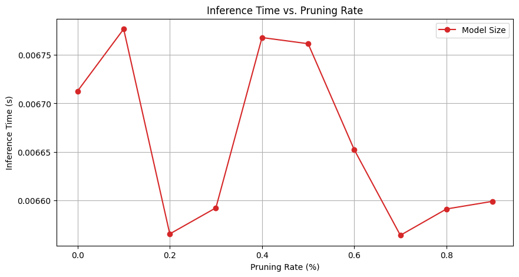

# Rendu pour le 4 Avril.


# Heterogeneous_Programming

## Sujet : ResNet - Classification d’images

Pour créer l'environement sur le finisterrae et s'y connecter:
- cd $STORE
- python3.7 -m venv my_env37
- source $STORE/my_env37/bin/activate
- pip install ipykernel
- python -m ipykernel install --user --name=my_env37 --display-name "Python 3.7 (my_env37)"
- jupyter lab --ip `hostname -i`
- Sélectionner le kernel "Python 3.7 (my_env37) (au lieu de myenv)


## Techniques d’optimisation

### 1 Pruning (Élagage des réseaux de neurones)
Le pruning est une méthode qui consiste à mettre les poids les plus faibles à zéro. Cette approche a notamment permis, pour les LLM, de mieux les stocker en réduisant leur taille et d'améliorer l'inférence sur CPU, le calcul des sparse matrices étant optimisé sur ce type de hardware.  

#### 1.1 Pruning Local
Le pruning local consiste à mettre les poids les plus faibles de chaque couche d'un modèle à zéro.  
Plusieurs tests ont été effectués en fonction du taux de pruning :
- le test d'accuracy a été réalisé sur un dataset de test composé de 10 000 images.  
- le test du temps d'inférence a été effectué sur les 1 000 premières images du dataset de test.  
  
  
  
D'après les résultats, on observe que :  
- l'accuracy sur le dataset de validation ne diminue pas jusqu'à un pruning de 0.1.  
- la taille du modèle ne change pas, car les poids du modèle ne sont pas supprimés mais simplement mis à zéro. L'architecture du modèle est donc maintenue. Un format de sauvegarde particulier et adapté pourrait améliorer le stockage en réduisant la taille du modèle. Dans ce cas, on observerait alors une diminution presque linéaire de la taille du modèle.  
- en moyenne, il n'y a pas de différences significatives entre les temps d'inférences pour 1 000 images, cela est peut être du à l'architecture du modèle qui n'est pas adapté au pruning.  

#### 1.2 Pruning Global
Le pruning global consiste à mettre les poids les plus faibles d'un modèle à zéro.  
Plusieurs tests ont été effectués en fonction du taux de pruning :  
  
  
  
D'après les résultats, on observe que:  
- l'accuracy sur le dataset de validation ne diminue qu'à partir d'un pruning de 0.2 et ne présente pas de diminution significative jusqu'à un pruning de 0.3.  
- comme dans l'approche précédente, la taille du modèle ne change pas.  
- de manière similaire, on n'observe pas de différences significatives entre les temps d'inférences pour 1 000 images.  
#### 1.3 Conclusion
Supprimer les poids les plus faibles du modèle en entier plutôt que par couche semble être une meilleure approche, car elle permet de maintenir des performances élevées tout en réduisant la taille théorique du modèle.  
### 2. Quantification

#### 2.1 Dynamique

La quantification s'est révélée plus complexe que prévu. En effet, il existe trois types de quantification, dont l'une est dite dynamique. Cette dernière est la plus simple à mettre en place, mais malheureusement, elle ne peut pas être appliquée efficacement à notre modèle. En effet, comme précisé dans la documentation, les couches convolutives (conv layers) ne sont pas affectées par cette méthode de quantification.


#### 2.2 Statique

### 2.2 Quantification statique  

En théorie, cette méthode de quantification est applicable, bien que légèrement plus complexe à mettre en place. Cependant, malgré tous les efforts déployés, le modèle devient inutilisable dès que l'on tente de l'appliquer avec la commande suivante :  

```python
model_quantized = quant.convert(model_prepared)
```

